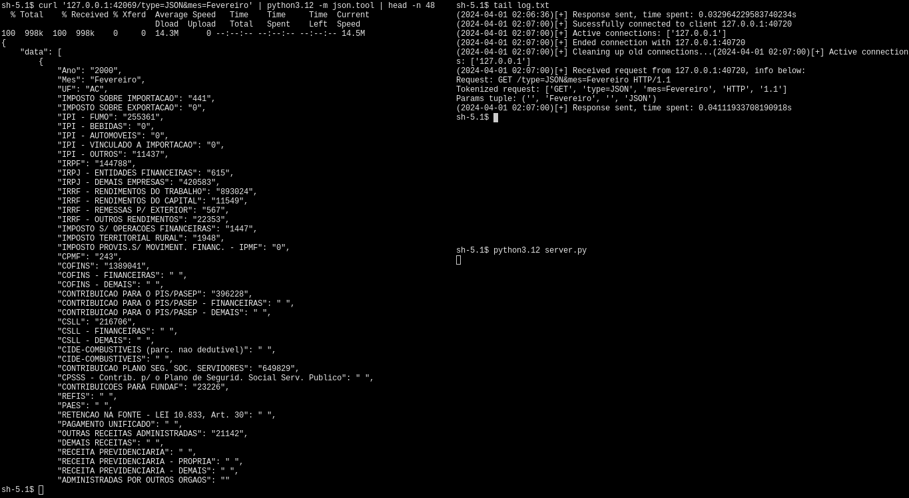

# Introdução  

Esse programa é uma API em escrita em python que serve os dados da arrecadação de impostos e contribuições federais administrados pela Secretaria Especial da Receita Federal do Brasil de 2000 a 2024. Os dados são classificados por mês, ano e estado. A fonte deles é o portal de dados abertos, acessivel **[nesse link](https://dados.gov.br/dados/conjuntos-dados/resultado-da-arrecadacao)**.

# Uso

A API consiste em três arquivos: `server_fork.py`, `server_threads.py`, `connections.py` e `config.py`. O arquivo `config.py` só deve ser alterado para modificar configurações e constantes.

O arquivo `client.py` foi utilizado apenas em benchmarks e é só um exemplo. Para mais detalhes acerca do padrão das requisições que devem ser enviadas à API, consulte a **[documentação](https://arrecadacaoapi.netlify.app)**.

Os arquivos `server_fork.py` e `server_threads.py` funcionam baseados em processos e threads, respectivamente. O arquivo `server_mono.py` não usa nem threads, nem processos, nem I/O assíncrono, ele responde um cliente por vez com um socket bloqueante.

***Todos os programas foram propriamente testados apenas em Linux.***

# Benchmarks

Para fazer os benchmarks foi utilizado o arquivo `client.py` numa máquina com 6GB de memória RAM e um processador i3 550. O servidor tem um tipo de proteção rudimentar contra DDoS que impede o mesmo endereço IP de fazer duas requisições no mesmo segundo. Essa proteção foi desligada durante os testes.

Em parte dos testes, foram feitas requisições esperando uma saída em JSON e sem nenhum outro tipo de argumento, noutra parte, as requisições esperavam saída em JSON e especificavam o mês como sendo Fevereiro. Essas são as requisições mais trabalhosas para o servidor.

As duas requisições supracitadas correspondem, respectivamente, à estas URLs:

`/type=json`
`/type=json&mes=Fevereiro`

O método de benchmark foi basicamente executar o `client.py`, redirecionar o output para um arquivo e executar o comando `awk '{ total += $1; i++ } END { print total/i }' arquivo.txt`. Ou seja, é uma média aritmética.

Note que ***o cliente e servidor foram executados na mesma máquina*** e que ***todos os testes foram feitos em Linux*** com ***python3.12***.

`server_fork.py`:

| Num. | Requisição 1 | Requisição 2 | 
|:----:|:------------:|:------------:|
| 1000 | 0.0842269s | 0.0524373s |
| 10000 | 0.0924639s | 0.0524949s |

`server_threads.py`:

| Num. | Requisição 1 | Requisição 2 |
|:----:|:------------:|:------------:|
| 1000 | 0.107947s | 0.0986064s |
| 10000 | 0.106986s | 0.0989524s |

`server_mono.py`:

| Num. | Requisição 1 | Requisição 2 |
|:----:|:------------:|:------------:|
| 1000 | 0.125409s | 0.108773s |
| 10000 | 0.119287s | 0.0877092s |
